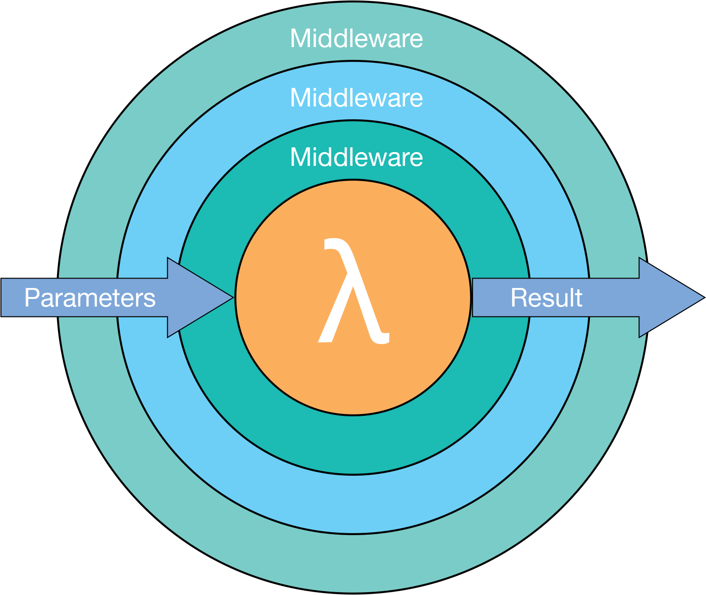

# Mw (Middleware)

[](http://mw.readthedocs.io/en/latest/?badge=latest)

The Mw library is a very flexible framework for converting middleware into handlers. Middleware offer a clean syntax for implementing the [Decorator Pattern](https://en.wikipedia.org/wiki/Decorator_pattern)

```php
<?php

use Krak\Mw;

$handler = mw\compose([
    function($s, $next) {
        return strtoupper($s);
    },
    function($s, $next) {
        return 'x' . $next($s . 'x');
    }
]);

$res = $handler('abc');
assert($res == 'xABCX');
```



## Installation

You can install this as a composer package at `krak/mw`

## Documentation

View them at [http://mw.readthedocs.io/en/latest/](http://mw.readthedocs.io/en/latest/)

Or build them:

```bash
make doc
```


## Tests and Examples

Run tests via:

```bash
make test
```

The Mw library uses [Peridot](http://peridot-php.github.io). These [tests](test/mw.spec.php) also provide good examples of how to use the library.
