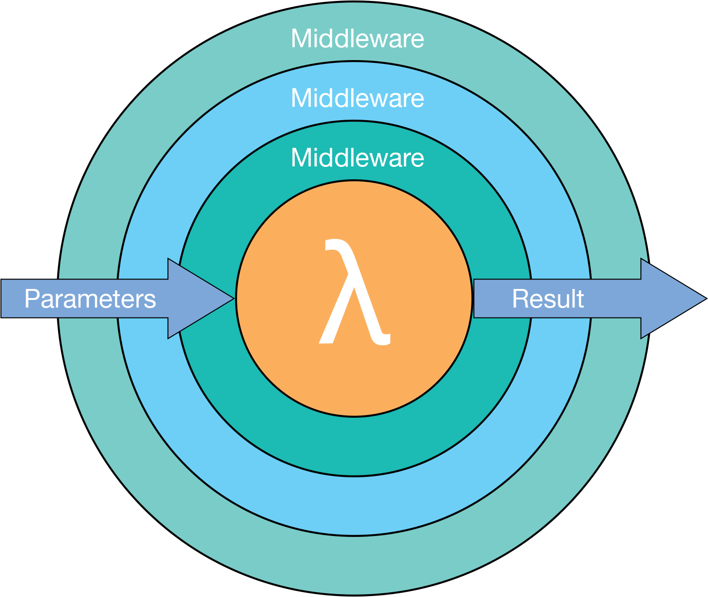

.. Mw documentation master file, created by
   sphinx-quickstart on Sun Nov 27 01:23:52 2016.
   You can adapt this file completely to your liking, but it should at least
   contain the root `toctree` directive.

Welcome to Mw's documentation!
==============================

The Mw library is a very flexible framework for converting middleware into handlers. Middleware offer a clean syntax for implementing the `Decorator Pattern <https://en.wikipedia.org/wiki/Decorator_pattern/>`_

Middleware provide a great system for extendable features and the Krak\\Mw library offers a simple yet powerful implementation to create middleware at ease.

.. code-block:: php

    <?php

    use Krak\Mw;

    $handler = mw\compose([
        function($s, $next) {
            return strtoupper($s);
        },
        function($s, $next) {
            return 'x' . $next($s . 'x');
        }
    ]);

    $res = $handler('abc');
    assert($res == 'xABCX');

.. toctree::
   :maxdepth: 2

   usage
   api
   advanced-usage
   troubleshooting
   cookbook
