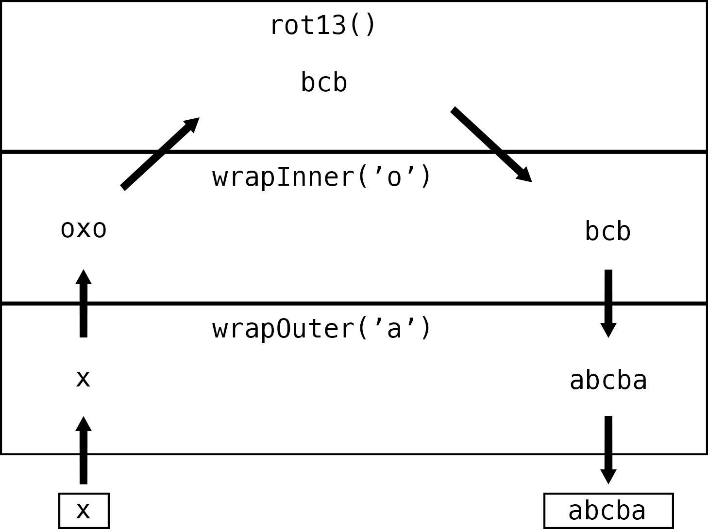

=====
Usage
=====

*Note:* each of these code samples can be seen in the ``example`` directory of the repo.

Here's an example of basic usage of the mw library

.. code-block:: php

    <?php

    use Krak\Mw;

    function rot13() {
        return function($s) {
            return str_rot13($s);
        };
    }

    function wrapInner($v) {
        return function($s, $next) use ($v) {
            return $next($v . $s . $v);
        };
    }
    function wrapOuter($v) {
        return function($s, $next) use ($v) {
            return $v . $next($s) . $v;
        };
    }

    $handler = mw\compose([
        rot13(),
        wrapInner('o'),
        wrapOuter('a'),
    ]);

    echo $handler('p') . PHP_EOL;
    // abcba

The first value in the array is executed last; the last value is executed first.

Each middleware shares the same format: ::

    function($arg1, $arg2, ..., $next);

A list of arguments, with a final argument $next which is the next middleware function to execute in the stack of middleware.

You can have 0 to n number of arguments. Every middleware needs to share the same signature. Composing a stack of middleware will return a handler which has the same signature as the middleware, but without the `$next` function.

**IMPORTANT:** At least one middleware MUST resolve a response else the handler will throw an error. So make sure that the last middleware executed (the first in the set) will return a response.

Before/After Middleware
=======================

Middleware can either be a *before* or *after* or both middleware. A before middleware runs before delegating to the ``$next`` middleware. An after middleware will runs *after* delegating to the ``$next`` middleware.

Before Style

.. code-block:: php

    <?php

    function($param, $next) {
        // code goes here
        // you can also modify the $param and pass the modified version to the next middleware
        return $next($param);
    }

After Style

.. code-block:: php

    <?php

    function($param, $next) {
        $result = $next($param);

        // code goes here
        // you can also modify the $result and return the modified version to the previous handler

        return $result;
    }

Stack
=====

The library also comes with a MwStack that allows you to easily build a set of middleware.

.. code-block:: php

    <?php

    use Krak\Mw;

    $stack = mw\stack('Stack Name');
    $stack->push(function($a, $next) {
        return $next($a . 'b');
    })
    ->push(function($a, $next) {
        return $next($a) . 'z';
    }, 0, 'c')
    // replace the c middleware
    ->on('c', function($a, $next) {
        return $next($a) . 'c';
    })
    ->before('c', function($a, $next) {
        return $next($a) . 'x';
    })
    ->after('c', function($a, $next) {
        return $next($a) . 'y';
    })
    // this goes on first
    ->unshift(function($a, $next) {
        return $a;
    });

    $handler = $stack->compose();
    $res = $handler('a');
    assert($res == 'abxcy');
